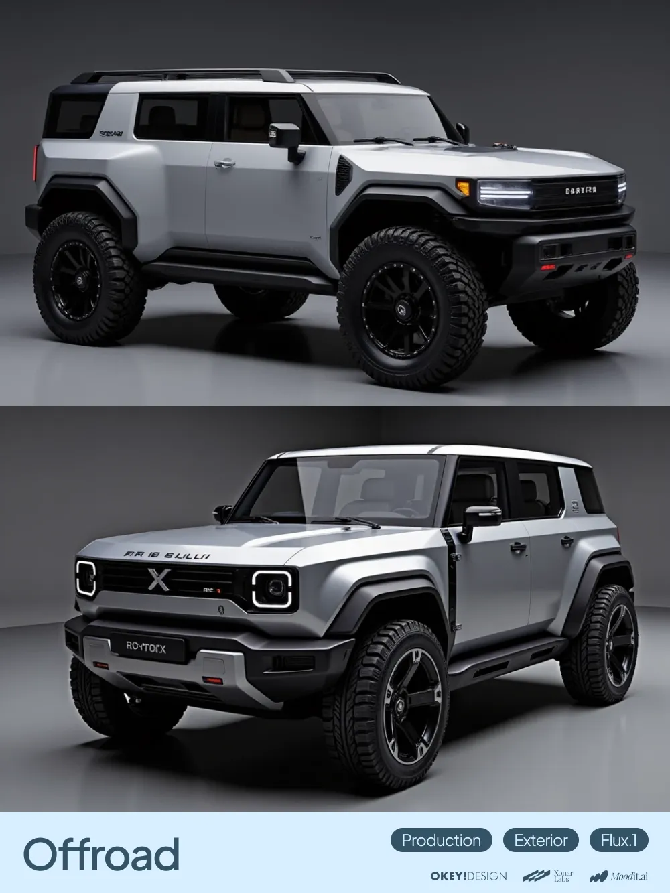
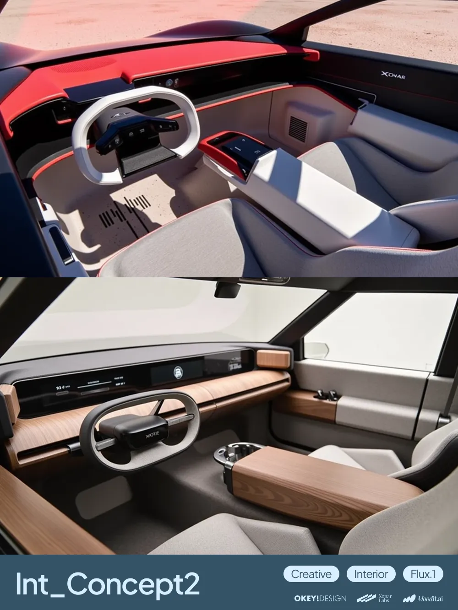
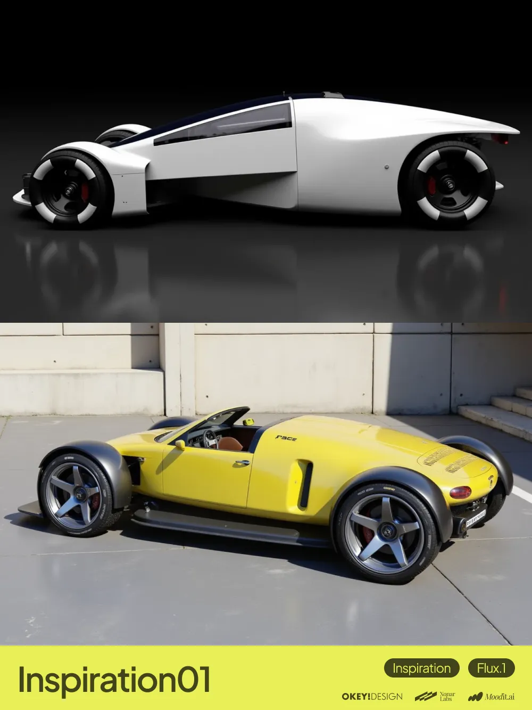
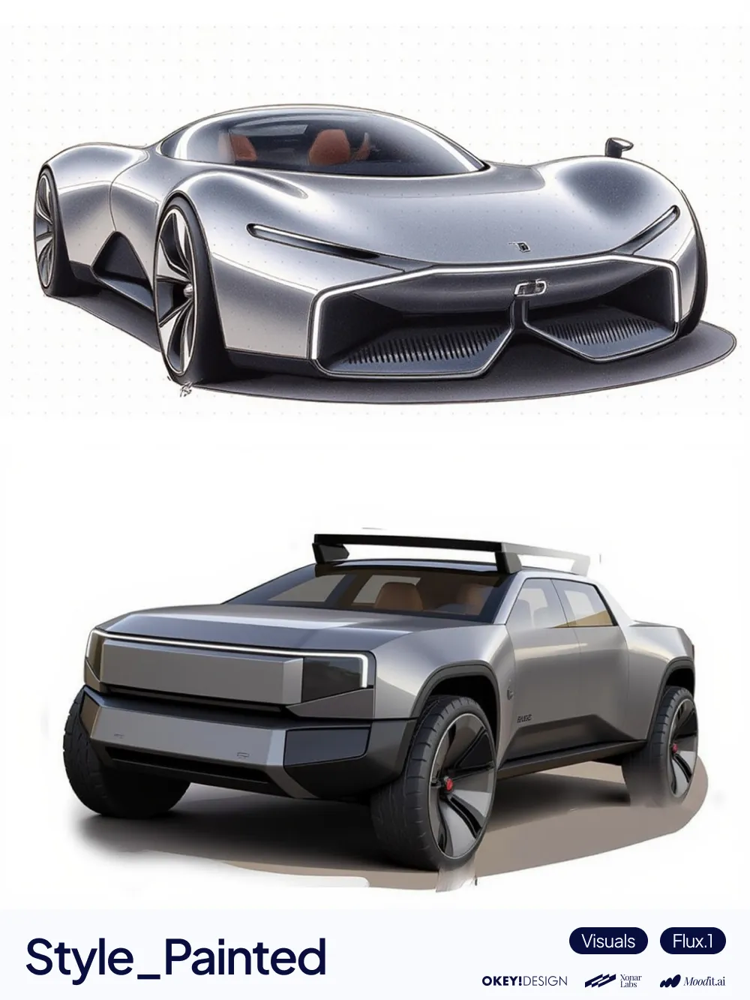

<!-- README.md -->

[English](./README.md) | [中文](./README.zh-CN.md)

# OLOID Framework
<table>
  <tr>
    <td width="25%" align="center"></td>
    <td width="25%" align="center"></td>
    <td width="25%" align="center"></td>
    <td width="25%" align="center"></td>
  </tr>
</table>

## About OLOID
OLOID Framework is an open-source LoRA framework for automotive design generation.

Built on Flux.1 dev, it is designed for agent retrieval and invocation, aiming to hand over the tedious parameter-tuning process in design gacha (LoRA stacking + seed sampling) workflows to agents and free up designers’ time.  
It also supports manual combination and use by designers.

## Framework Structure
The current release includes 49 LoRAs, organized across four dimensions and designed to be combined based on different design goals.  
For example: PRD (define volume) + CRT (add form language) + INS (expand creative possibilities) + VIS (control visual output)

| Dimension | Code | Role |
| --- | --- | --- |
| Production | PRD | Production-oriented volume, proportion, and structural foundation |
| Creative | CRT | Advances form language and design variation |
| Inspiration | INS | Introduces cross-domain design language and additional stimulus |
| Visuals | VIS | Controls image style, material feel, and overall visual impression |

A full structural overview is shown below:  
  
*Figure: Full structure across PRD / CRT / INS / VIS and EXT / INT / PART.*

## Index
For each LoRA’s trigger words, reference prompts, and recommended weights, please refer to the index:

- [GitHub](./INDEX.md)
- [Feishu Doc](https://ucnd3tftqho9.feishu.cn/wiki/UUe5wZy9CiaQspkNEErcuzMqnie)

## Download
All LoRA files are hosted on Hugging Face:

- [Hugging Face](https://huggingface.co/XonarLabs/OLOID_Framework)

## Project Status
The current phase of OLOID on Flux.1 has been completed. We have already moved on to exploring next-generation model training and a more complete agent-oriented workflow, so this generation will no longer be updated.  
Feedback and testing are welcome.

For discussions around AI generation systems for automotive design, please contact OkeyDesign: hello@okeydesign.com  
For custom training, agent-related and other technical topics, please contact XonarLabs: info@xonarlabs.com

## License
This model is built on FLUX.1 dev.  
Usage may be subject to the base model's license restrictions.

## Credits
OkeyDesign & XonarLabs
